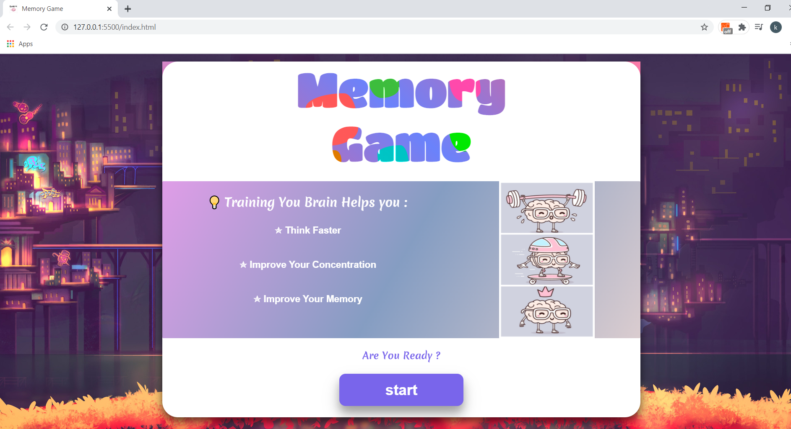

# Memory-Game
The Brain 🧠 is the muscle that can move the world 🌍!
this is a 60 sec  Fun card  𝗺𝗲𝗺𝗼𝗿𝘆 𝗴𝗮𝗺𝗲 🎮🃏
• • 𝙗𝙚𝙘𝙖𝙪𝙨𝙚 𝙤𝙪𝙧 𝙗𝙧𝙖𝙞𝙣𝙨 𝙣𝙚𝙚𝙙 𝙖 💪 𝙬𝙤𝙧𝙠𝙤𝙪𝙩 𝙩𝙤𝙤.

# Rules 
 * 60 sec to Find all matching cards by flip two by to to check for a match
# Features 
* Test his memoryand challenge himself to find all matched cards in under 60sec 
* replay in case of loss/ win  
 ## overview :
 
 

## DEMO 
 https://www.youtube.com/watch?v=FfgEquhwX8M
  # Stack : 

 * HTML 
 * JavaScript
 * CSS
# Getting Started 
 
 * Clone or download repo 
 * Open HTML file and let's start playing  =)
 
